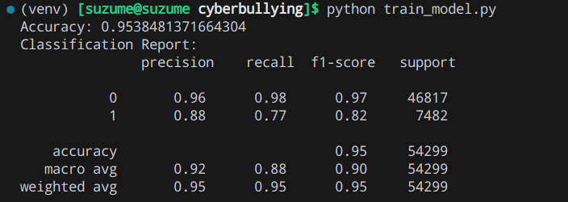
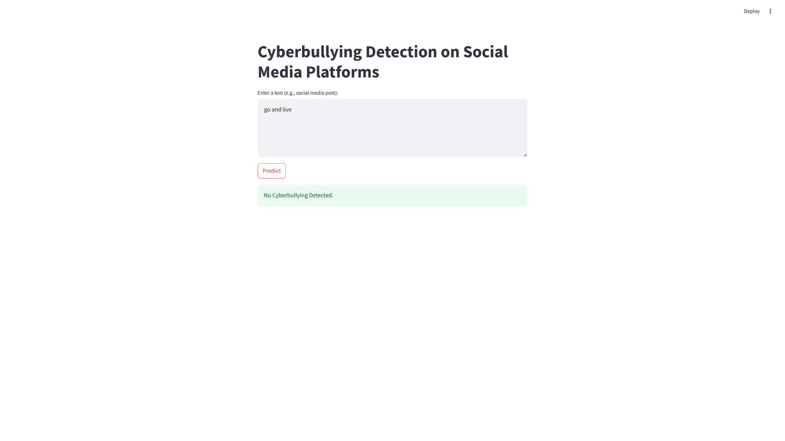
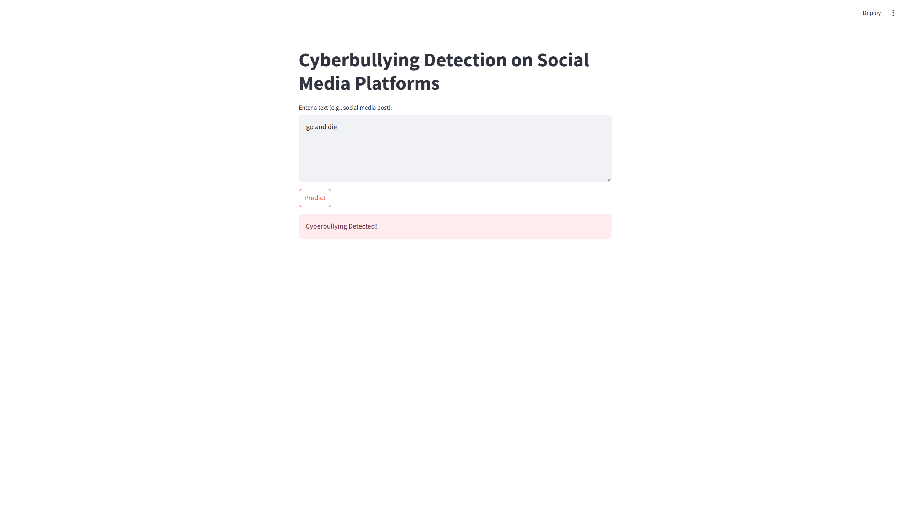

# Cyberbullying Detection App

## Overview
This project aims to detect cyberbullying in social media posts using machine learning. The app combines multiple datasets, preprocesses the data, trains a classification model, and provides a user-friendly interface for real-time predictions. The Streamlit-based chatbot UI allows users to input text and receive instant feedback on whether the text contains cyberbullying.

---

## Features
1. **Dataset Combination**:
   - Combines multiple datasets into one large dataset for training.
   - Preprocesses text data (e.g., removing URLs, stopwords, and special characters; stemming).

2. **Machine Learning Model**:
   - Trains a Random Forest classifier using TF-IDF vectorization.
   - Supports explainability by highlighting toxic words/phrases that contribute to the prediction.

3. **Chatbot UI**:
   - Provides a conversational interface for users to interact with the model.
   - Automatically fetches predictions when the "Enter" key is pressed.
   - Highlights toxic words in the input text for better transparency.

4. **Explainability**:
   - Explains why a text was flagged as cyberbullying by identifying toxic keywords.

---

## Screenshots

### 1. Model Accuracy Result
The trained model achieves an accuracy of **95.38%** on the test dataset. Below is a screenshot of the accuracy result:



---

### 2. User Interface (UI) - Chatbot Interaction
The app provides a chatbot-like interface where users can type their messages and receive instant feedback. Below are screenshots of the UI:

#### Input and Response Example


#### Highlighted Toxic Words


---

## Datasets
The following datasets are used in this project:

| Dataset Name                     | Description                                                                 |
|----------------------------------|-----------------------------------------------------------------------------|
| `aggression_parsed_dataset.csv`  | Contains labeled data for aggressive language detection.                   |
| `attack_parsed_dataset.csv`      | Focuses on personal attacks and offensive language.                        |
| `kaggle_parsed_dataset.csv`      | A general dataset for toxic comment classification.                        |
| `toxicity_parsed_dataset.csv`    | Labeled data for toxicity detection in text.                               |
| `twitter_parsed_dataset.csv`     | Tweets labeled for various forms of abusive language.                      |
| `twitter_racism_parsed_dataset.csv` | Tweets specifically labeled for racist content.                         |
| `twitter_sexism_parsed_dataset.csv` | Tweets specifically labeled for sexist content.                         |
| `youtube_parsed_dataset.csv`     | Comments from YouTube labeled for cyberbullying and hate speech.           |

Each dataset contains at least the following columns:
- `Text`: The raw text data.
- `oh_label`: Binary label indicating whether the text is cyberbullying (1) or not (0).

---

## Installation and Setup

### Prerequisites
- Python 3.8 or higher
- Virtual environment (optional but recommended)

### Steps to Set Up
1. **Clone the Repository**:
   ```bash
   git clone https://github.com/Divith123/
   cd cyberbullying-detection
   ```

2. **Create a Virtual Environment**:
   ```bash
   python3 -m venv venv
   source venv/bin/activate  # On Windows: venv\Scripts\activate
   ```

3. **Install Dependencies**:
   ```bash
   pip install -r requirements.txt
   ```

4. **Download NLTK Resources**:
   Run the following command to download required NLTK resources:
   ```python
   import nltk
   nltk.download('stopwords')
   ```

5. **Prepare the Dataset**:
   Ensure all datasets are placed in the `datasets/` folder. Run the script to combine and preprocess the datasets:
   ```bash
   python combine_datasets.py
   ```

6. **Train the Model**:
   Train the machine learning model using the combined dataset:
   ```bash
   python train_model.py
   ```

7. **Run the App**:
   Start the Streamlit app:
   ```bash
   streamlit run app.py
   ```

---

## Usage
1. Open the app in your browser (default URL: `http://localhost:8501`).
2. Type a message in the input box and press "Enter."
3. The app will analyze the text and display whether it contains cyberbullying.
4. If cyberbullying is detected, the app will highlight toxic words/phrases that contributed to the decision.

---

## Example Interaction

#### Input:
```
"You are worthless and should die."
```

#### Output:
```
⚠️ Cyberbullying Detected!
The following words/phrases may have contributed to this decision: worthless, die.
```

#### Input:
```
"I love spending time with my friends."
```

#### Output:
```
✅ No Cyberbullying Detected.
```

---

## Project Structure
```
cyberbullying/
├── datasets/               # Folder containing all datasets
├── models/                 # Folder to save trained models and vectorizer
├── screenshots/            # Folder containing screenshots (1.png, 2.png, 3.png)
├── combine_datasets.py     # Script to combine and preprocess datasets
├── train_model.py          # Script to train the machine learning model
├── app.py                  # Streamlit app for real-time predictions
├── README.md               # This file
└── requirements.txt         # List of dependencies
```

---

## Future Enhancements
1. **Model Improvements**:
   - Experiment with advanced models like BERT for better performance.
   - Use techniques like SMOTE to handle class imbalance.

2. **UI Enhancements**:
   - Add more visual cues (e.g., emojis, colors) to improve user experience.
   - Allow users to download their chat history.

3. **Deployment**:
   - Deploy the app to Streamlit Cloud or Heroku for public access.

---

## License
This project is licensed under the MIT License. See the [LICENSE](LICENSE) file for details.

---

## Contact
For questions or feedback, please contact:
- Email: hustleronduty@gmail.com
- GitHub: [@Divith123](https://github.com/Divith123)

---

This updated `README.md` includes references to the screenshots in the `/screenshots` directory, making them visible to users who view the project. Let me know if you need further assistance!
